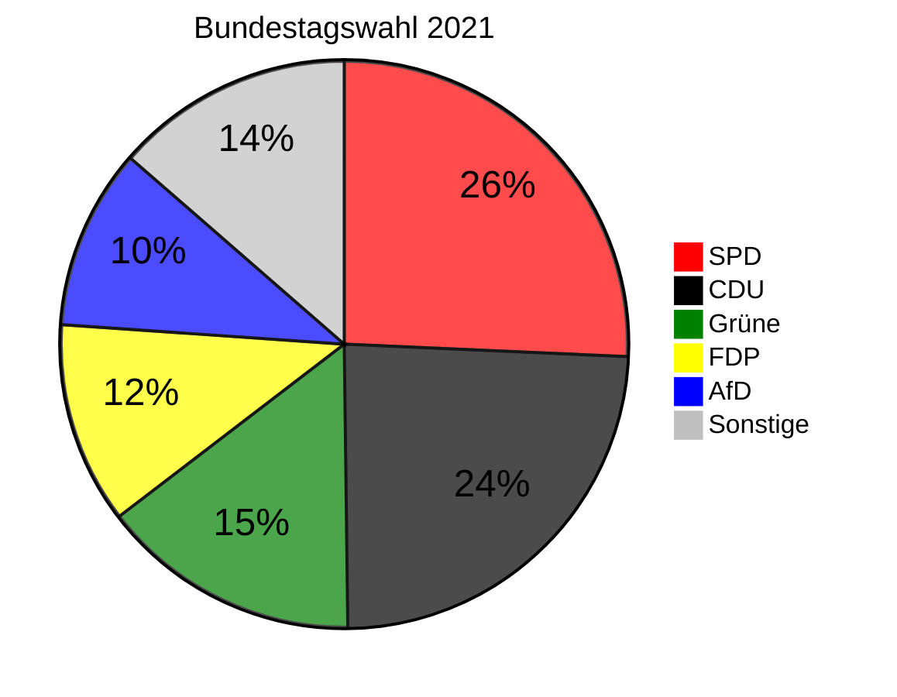
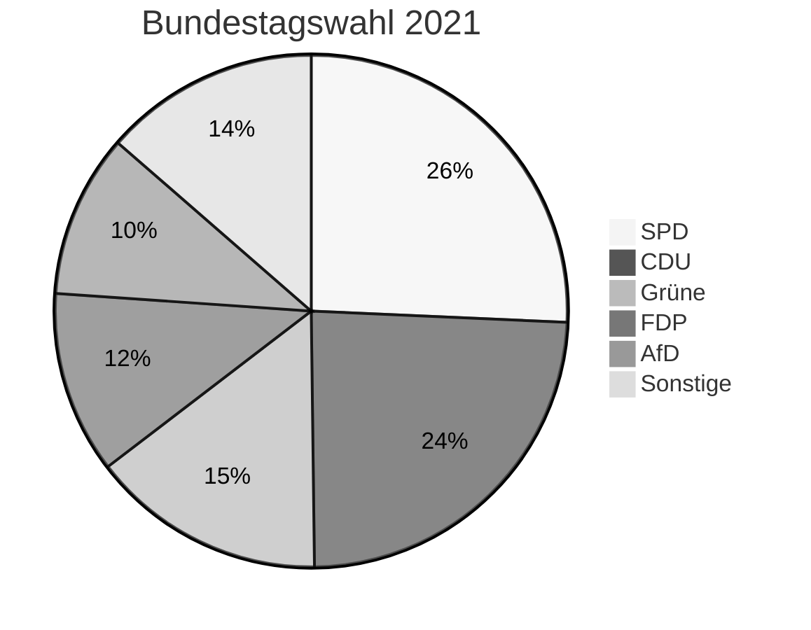

# Markdown crashtest

**Dieses Dokument dient der Überprüfung, welche Optionen vom Markdown Parser unterstützt werden.**

## Inhaltsverzeichnis

[inhaltsverzeichnis]:(#inhaltsverzeichnis)


- [Textformatierung](#textformatierung)
- [Blockquotes](#blockquotes)
- [Listen](#listen)
- [Zeilenumbruch](#zeilenumbruch)
- [Horizontale Linien](#horizontale-linien)
- [Links](#links)
- [Code](#code)
- [Grafiken](#grafiken)
- [Tabellen](#tabellen)
- [Fußnoten](#fussnoten)
- [Definitionslisten](#definitionslisten)
- [Header](#header)
- [html](#html)
- [MathJax](#mathjax)
- [Mermaid](#mermaid)

----

## Textformatierung

### **fett**

**Syntax:**

    Markieren Sie den Text mit **zwei Sternchen** oder __zwei Unterstrichen__

**Ausgabe:**

Markieren Sie den Text mit **zwei Sternchen** oder __zwei Unterstrichen__

### *Kursiv*

**Syntax:**

    Markieren Sie den Text mit *einem Stern* oder _einem Unterstrich_

**Ausgabe:**

Markieren Sie den Text mit *einem Stern* oder _einem Unterstrich_

### ***fett und Kursiv***

**Syntax:**

    Markieren Sie den Text mit ***drei Sternchen*** oder ___drei Unterstrichen___

**Ausgabe:**

Markieren Sie den Text mit ***drei Sternchen*** oder ___drei Unterstrichen___

### ~~Durchgestrichen~~

**Syntax:**

    Markieren Sie den Text mit ~~zwei Tilden~~ 

**Ausgabe:**

Markieren Sie den Text mit ~~zwei Tilden~~

### ==markiert==

**Syntax:**

    Markieren Sie den Text mit ==zwei Gleichheitszeichen== 

**Ausgabe:**

Markieren Sie den Text mit ==zwei Gleichheitszeichen==

### tief~gestellt~

**Syntax:** 

    Mit einer ~Tilde~ wird tiefgestellt (H\~2\~O).
  
**Ausgabe:**

Mit einer ~Tilde~ wird tiefgestellt (H~2~O).


### hoch^gestellt^
  
**Syntax:**
  
    Mit einem ^Dach^ wird hochgestellt (m^2^).
  
**Ausgabe:**
  
Mit einem ^Dach^ wird hochgestellt (m^2^).

[▲ Inhaltsverzeichnis ▲][inhaltsverzeichnis]

----

## Blockquotes

**Syntax:**

    > Blockquote
    
**Ausgabe:**

 > Blockquote
 
### verschachtelte Blockquotes
 
 **Syntax:**
 
    > erste Ebene
    >
    >> zweite Ebene
    
**Ausgabe:**

> erste Ebene
>
>> zweite Ebene

### Markdown in Blockquotes

**Syntax:**

    > **Markdown** kann innerhalb von **Blockquotes** verwendet werden
    >
    > 1.   Dies ist der erste Listenpunkt
    > 1.   Dies ist der zweite Listenpunkt
    >
    > ~~durchgestrichen~~
    >
    > Hier ist ein Beispielcode:
    >
    >     <script>
    >       console.log('myScript')
    >     </script>

**Ausgabe:**

> **Markdown** kann innerhalb von **Blockquotes** verwendet werden
>
> 1.   Dies ist der erste Listenpunkt
> 1.   Dies ist der zweite Listenpunkt
>
> ~~durchgestrichen~~
>
> Hier ist ein Beispielcode:
>
>     <script>
>       console.log('myScript')
>     </script>

[▲ Inhaltsverzeichnis ▲][inhaltsverzeichnis]

----

## Listen

### Ungeordnete Liste

eine ungeordnete Liste wird mit **-**,**+** oder **\*** eingeleitet

**Syntax:**

    - Listenelement 1
    - Listenelement 2
    - Listenelement 3
    
    + Listenelement 1
    + Listenelement 2
    + Listenelement 3
    
    * Listenelement 1
    * Listenelement 2
    * Listenelement 3

**Ausgabe:**

- Listenelement 1
- Listenelement 2
- Listenelement 3

+ Listenelement 1
+ Listenelement 2
+ Listenelement 3

* Listenelement 1
* Listenelement 2
* Listenelement 3

### geordnete Liste

eine geordnete Liste wird mit **1.** eingeleitet, die Inkrementierung erfolgt automatisch, Sie können daher überall **1.** verwenden.

**Syntax:**

    1. Listenelement 1
    2. Listenelement 2
    1. Listenelement 3

**Ausgabe:**

1. Listenelement 1
2. Listenelement 2
1. Listenelement 3

### verschachtelte Liste

**Syntax:**

    - Listenelement 1
    - Listenelement 2
      1. eingerücktes Listenelement
      1. eingerücktes Listenelement
    - Listenelement 3

**Ausgabe:**

- Listenelement 1
- Listenelement 2
  1. eingerücktes Listenelement
  1. eingerücktes Listenelement
- Listenelement 3

### Markdown innerhalb von Listenelementen

Markdown kann innerhalb von Listenelementen verwendet werden. Sie müssen lediglich die Einrückungen, **mit Leerzeichen !!**,  beachten.  Diese sind in folgendem Codeabschnitt mit Punkten markiert.
  
**Syntax:**

    -·Listenelement 1⏎
    ··⏎
    ··Ein normaler Absatz mit **fettem Wort**⏎
    ··⏎
    ··> Ein Blockquote⏎
    ··⏎
    ··- eingerücktes Listenelement⏎
    ····1. ein weiter eingerücktes Listenelement⏎
    ··- noch ein eingerücktes Listenelement⏎
    ··⏎
    ··Ein weiterer Absatz⏎
    ··⏎
    ·······Ein Codeblock⏎
    ··⏎
    - Listenelement 2⏎
    - Listenelement 3⏎


**Ausgabe:**

- Listenelement 1
  
  Ein normaler Absatz mit **fettem Wort**
  
  > Ein Blockquote
  
  - eingerücktes Listenelement
  - noch ein eingerücktes Listenelement
    
    Ein weiterer Absatz
  
        Ein Codeblock
    
- Listenelement 2
- Listenelement 3

[▲ Inhaltsverzeichnis ▲][inhaltsverzeichnis]

----

## Zeilenumbruch

### einfacher Zeilenumbruch

Wenn Sie einmal die Eingabetaste zwischen zwei Zeilen drücken, werden beide Zeilen zu einem einzigen Absatz zusammengefügt.

Wenn Sie jedoch eine leere Zeile zwischen ihnen lassen, werden sie in zwei Absätze aufgeteilt.

**Syntax:**

    Dieser Text ist ein Absatz.
    Dies wird kein weiterer Absatz sein, sondern sich mit der obigen Zeile verbinden.
    
    Dies wird ein weiterer Absatz sein, da es eine leere Zeile darüber gibt.

**Ausgabe:**

Dieser Text ist ein Absatz.
Dies wird kein weiterer Absatz sein, sondern sich mit der obigen Zeile verbinden.

Dies wird ein weiterer Absatz sein, da es eine leere Zeile darüber gibt.

### erzwungener Zeilenumbruch

Um einen Zeilenumbruch zu erzwingen, beenden Sie eine Zeile mit **zwei oder mehr Leerzeichen** und geben dann Return ein.

**Syntax:**

    Das ist die erste Zeile.··⏎
    Das ist die zweite Zeile.


**Ausgabe:**

Das ist die erste Zeile.  
Das ist die zweite Zeile.

[▲ Inhaltsverzeichnis ▲][inhaltsverzeichnis]

----

## Horizontale Linien

werden mit vier aufeinanderfolgenden **\*** , **-** oder **\_** eingefügt. 

**Syntax:**

```
Ein Absatz

****

Noch ein Absatz.

----

Noch ein Absatz.

____

Ein weiterer Absatz.
```

**Ausgabe:**

Ein Absatz

****

Noch ein Absatz

----

Noch ein Absatz

____

Ein weiterer Absatz.

[▲ Inhaltsverzeichnis ▲][inhaltsverzeichnis]

----

## Links

### Inline Link

Der Linktext wird mit **\[**eckigen**\]** Klammern definiert. Direkt hinter der schließenden Klammer wird die URL in **(**runde Klammern**)** gesetzt.

**Syntax:**
    [MdParser](https://github.com/frankwisniewski/mdparser)

**Ausgabe:**

[MdParser](https://github.com/frankwisniewski/mdparser)

Verweist man auf einen Link innerhalb der eigenen Website genügt folgendes:

**Syntax:** 

    [local](/local.htm)

**Ausgabe:**

[local](/local.htm)

### Inline Link mit Titel Attribut

Will man einen Link mit einem Titel versehen, welches beim "mouseOver" Ereignis angezeigt werden soll, wird der Titel in innerhalb von **\"**, **\'** oder **\(** gesetzt.

**Syntax**

    [MdParser](https://github.com/frankwisniewski/mdparser "MarkDown Parser")

    [MdParser](https://github.com/frankwisniewski/mdparser 'MarkDown Parser')

    [MdParser](https://github.com/frankwisniewski/mdparser (MarkDown Parser))

**Ausgabe:**

[MdParser](https://github.com/frankwisniewski/mdparser "MarkDown Parser")

[MdParser](https://github.com/frankwisniewski/mdparser 'MarkDown Parser')

[MdParser](https://github.com/frankwisniewski/mdparser (MarkDown Parser))

### Referenzlink

Ein Referenz Link wird an beliebiger Stelle im Dokument definiert. 

**Syntax:**

    [github]: https://github.com/frankwisniewski/mdparser


[github]: https://github.com/frankwisniewski/mdparser 

Der Referenzlink wird nicht ausgegeben.

Der Verweis auf den Referenzlink:

**Syntax:**

    Der Parser kann [hier][github] heruntergeladen werden.

**Ausgabe:**

Der Parser kann [hier][github] heruntergeladen werden.

### Referenzlink mit Titel Attribut

**Syntax:**

    [github1]: https://github.com/frankwisniewski/mdparser "MarkDown Parser"
    [github2]: https://github.com/frankwisniewski/mdparser 'MarkDown Parser'
    [github3]: https://github.com/frankwisniewski/mdparser (MarkDown Parser)

Die Referenzlinks werden nicht ausgegeben.

[github1]: https://github.com/frankwisniewski/mdparser "MarkDown Parser"
[github2]: https://github.com/frankwisniewski/mdparser 'MarkDown Parser'
[github3]: https://github.com/frankwisniewski/mdparser (MarkDown Parser)

**Syntax:**

    dieser [link][github1] führt zu Github.

**Ausgabe:**

dieser [link][github1] führt zu Github.

### Referenz ohne Bezeichner

**Syntax:**

    Link zu [github]

**Ausgabe:**

Link zu [github]

### Links als Url

Sie können auch direkt die Url eingeben

**Syntax:**

    Besuchen sie meine Github Seite: 
    https://github.com/frankwisniewski/mdparser

**Ausgabe:**

Besuchen sie meine Github Seite:
https://github.com/frankwisniewski/mdparser

### E-Mail Links

E-Mail Links werden analog zu vorstehenden Links einleitend mit **mailto:** definiert:

**Syntax:**

    [mail](mailto:frank@wisniewski.de "Nachricht an Frank Wisniewski")

**Ausgabe:**

[mail](mailto:frank@wisniewski.de "Nachricht an Frank Wisniewski")

oder auch direkt:

**Syntax:**

    Schicken Sie eine Mail an fhw@wisniewski.de

**Ausgabe:**

Schicken Sie eine Mail an fhw@wisniewski.de

[▲ Inhaltsverzeichnis ▲][inhaltsverzeichnis]

----

## Code

### Eingerückter Codeblock

Um einen Code Block zu erstellen, muss jede Zeile des Codeblocks um mindestens **4** Leerzeichen eingerückt werden

**Syntax**

```
····<script>⏎
······console.log('myTest')⏎
····</script>⏎
```

**Ausgabe:**

    <script>
      console.log('myTest')
    </script>

### begrenzte Codeblöcke

Es ist empfehlenswert diese Kennzeichnung von Code Blöcken zu benutzen. Hierzu wird jeweils vor und hinter dem Codeblock, eine Zeile bestehend aus drei Backticks ` ``` ` eingefügt.

**Syntax:**

**Syntax:**

    ```
    <script>
      console.log('myTest')
    </script>
    ```

**Ausgabe:**

```
<script>
  console.log('myTest')
</script>
```

### begrenzte Codeblöcke mit Syntax Highlighting

Beabsichtigen Sie mit einem Syntax Highlighter zu arbeiten geben Sie die entsprechende Sprachbezeichnung hinter den 3 Backticks an. Beispiel ` ```javascript `

**Syntax:**

    ```javascript
    <script>
      console.log('myTest')
    </script>
    ```

**Ausgabe:**

```javascript language-javascript
<script>
  console.log('myTest')
</script>
```

### inline Code

Inline Code innerhalb eines Absatzes wird jeweils mit einem Backtick `` ` `` begrenzt. Wenn Sie einen einzeln Backtick innerhalb des Inline Code darstellen müssen, begrenzen Sie den Inline Code mit zwei ` `` ` Backticks.

**Syntax:**

    Zur Erstellung einer horizontalen Linie wird `<hr>` benutzt.··⏎
    Ein Backtick wird wie folgt ausgegeben `` ` ``.

**Ausgabe:**

Zur Erstellung einer horizontalen Linie wird `<hr>` benutzt.  
Ein Backtick wird wie folgt ausgegeben `` ` ``.

[▲ Inhaltsverzeichnis ▲][inhaltsverzeichnis]

----

## Grafiken

### Inline Syntax

Der Aufbau zum Abruf von Grafiken ähnelt der Link Syntax jedoch beginnend mit einem **!** Ausrufezeichen.

**Syntax:**

    

**Ausgabe:**


Möchten Sie beim MouseOver Ereignis eine Bildbeschreibung anzeigen, wird der Titel wie bei den Links innerhalb von **\"**, **\'** oder **\(** gesetzt.

**Syntax:**

    
    
    
    
    )


**Ausgabe:**


)


### Image Referenzlink

Ein Referenzlink für Bilder wird ebenso, wie der Reflink für Links angelegt.

**Syntax:**

    [wolke]: https://frankwisniewski.github.io/mdparser/demo.webp 'Eine Wolke mit dem Wort DEMO'

Es erfolgt keine Ausgabe

[wolke]: https://frankwisniewski.github.io/mdparser/demo.webp 'Eine Wolke mit dem Wort DEMO'

Der Referenzierte Link wird wie folgt aufgerufen, wobei der Text in der ersten eckigen Klammer derjenige ist, der angezeigt wird, wenn das Bild nicht gefunden wurde

**Syntax:**

    ![Bild mit Wolke][wolke] 

**Ausgabe:**

![Bild mit Wolke][wolke] 

Sie können auch auf den alternativen Text verzichten, dann wird als alternativer Text der Referenztext angezeigt.

**Syntax:**

    ![wolke] 

**Ausgabe:**

![wolke] 

### Image Link

Ein Link, der anstelle eines Textes ein Bild darstellt, wird mit `[](https://github.com/frankwisniewski/mdparser)
    
    [](https://github.com/frankwisniewski/mdparser)
    
    [)](https://github.com/frankwisniewski/mdparser)

**Ausgabe:**

[](https://github.com/frankwisniewski/mdparser)

[](https://github.com/frankwisniewski/mdparser)

[)](https://github.com/frankwisniewski/mdparser)

[▲ Inhaltsverzeichnis ▲][inhaltsverzeichnis]

----

## Tabellen

Tabellen werden wie folgt definiert:

**Syntax:**

```
| Element | Inhalt |
| ------- | ------ |
| h1 - h6 | Titel  |
| img     | Bild   |
```

**Ausgabe:**

| Element | Inhalt |
| ------- | ------ |
| h1 - h6 | Titel  |
| img     | Bild   |

Alternativ ist auch folgende, optisch weniger ansprechende,  Definition möglich:

**Syntax:**

    Element | Inhalt 
    --- | --- 
    h1 - h6 | Titel
    img | Bild

**Ausgabe:**

Element | Inhalt 
--- | --- 
h1 - h6 | Titel
img | Bild

### Ausrichtung der Tabellenzellen

Die Position des Doppelpunktes bestimmt die Ausrichtung der Tabellenzellen

- links ausgerichtet ` :--- `
- rechts ausgerichtet ` ---: `
- zentriert ausgerichtet ` :---: `

**Syntax:**
```
| Element | Inhalt    | Codebeispiel    |  
| :------ | :-------: | --------------: |
| links   | zentriert | rechts          |   
| h1 - h6 | Titel     | `<h1> - <h6>`   |
| img     | Bild      | `` |
```

**Ausgabe:**

| Element | Inhalt    | Codebeispiel    |  
| :------ | :-------: | --------------: |
| links   | zentriert | rechts          |   
| h1 - h6 | Titel     | `<h1> - <h6>`   |
| img     | Bild      | `` |

### Markdown in Tabellen

Die Texte innerhalb der Tabellen können entsprechend des Abschnitts [Textformatierung](#textformatierung) gestaltet werden.

**Syntax:**
```
| Element | Inhalt          | Codebeispiel    |  
| :------ | :-------------: | --------------: |
| *links* | **zentriert**   | ==rechts==      |   
| h1 - h6 | Titel           | `<h1> - <h6>`   |
| img     | Bild            | `` |
```


**Ausgabe:**

| Element | Inhalt          | Codebeispiel    |  
| :------ | :-------------: | --------------: |
| *links* | **zentriert**   | ==rechts==      |   
| h1 - h6 | Titel           | `<h1> - <h6>`   |
| img     | Bild            | `` |

[▲ Inhaltsverzeichnis ▲][inhaltsverzeichnis]

----

## Fußnoten {#fussnoten}

Fußnoten werden unter dem Fließtext einer Seite angezeigt und mit ` [^quelle] ` aufgerufen. Der Fußnotentext wird mit ` [^quelle]: ` definiert, achten Sie auf den **Doppelpunkt**!

**Syntax:**

```
Markdown[^markdown] ist eine Auszeichnungssprache  
(Sie sehen das Ergebnis am Ende der Seite)

[^markdown]: Weiterführende Informationen hierzu finden Sie auch bei [**Wikipedia**](https://de.wikipedia.org/wiki/Markdown)
```

**Ausgabe:**

Markdown[^markdown] ist eine Auszeichnungssprache  
(Sie sehen das Ergebnis am Ende der Seite, wenn Sie auf die ^**1**^ in vorherigem Satz klicken)

[^markdown]: Weiterführende Informationen hierzu finden Sie auch bei [**Wikipedia**](https://de.wikipedia.org/wiki/Markdown)


### lange Fußnoten

Fußnoten, bestehend aus mehreren Absätzen und anderen Elementen müssen entsprechend eingerückt werden. Beachten Sie, dass **leer dargestellte Zeilen** auch mit Leerzeichen eingerückt werden müssen.

**Syntax:**

    Die Variablen eines Javascript Programms können mit ` console.log `[^console] angezeigt werden.
     
    [^console]: Folgender Code zeigt, wie man Function `console.log` anwendet.
    
        **Javscript Code:**
        
        ```javascript
        <script>
        let myVar = "Markdown"
        console.log( myVar )
        // Ausgabe: Markdown
        </script>
        ```
        Zurück zum Fußnotenaufruf:


**Ausgabe:**

Die Variablen eines Javascript Programms können mit **console.log**[^console] angezeigt werden.

[^console]: Folgender Code zeigt, wie man die Function `console.log` anwendet.
  
  **Javscript Code:**
  
  ```javascript
  <script>
  let myVar = "Markdown"
  console.log( myVar )
  // Ausgabe: Markdown
  </script>
  ```
  Zurück zum Fußnotenaufruf:
  
### nicht vorhandene Fußnote

Ist eine Fußnote nicht vorhanden, wird ein error angezeigt.

**Beispiel:**

    das ist eine unbekannte Fußnote[^unbekannt]

**Ausgabe:**

das ist eine unbekannte Fußnote[^unbekannt]

[▲ Inhaltsverzeichnis ▲][inhaltsverzeichnis]

----

## Definitionslisten

Definitionslisten ähneln den ungeordneten und geordneten Listen, seit **HTML5** werden diese mit *decription list* bezeichnet. Sie eigenen sich bspw. für Glossare und Kalendereinträge. Anstelle der Listenpunkte und Ordnungszahlen wird hier ein Begriff genutzt. 

Beachten Sie, dass **leer dargestellte Zeilen** auch mit Leerzeichen eingerückt werden müssen.

**Syntax:**

```markdown
Javascript 
: JavaScript ist eine Programmiersprache, die in erster Linie für die Entwicklung von
  Webanwendungen verwendet wird. Mit JavaScript können Webentwickler interaktive Elemente auf Webseiten erstellen, wie zum Beispiel Popups, Animationen und dynamische Effekte, die auf Benutzereingaben reagieren.
  
  JavaScript wurde von Netscape entwickelt und 1995 erstmals veröffentlicht. Seitdem hat sich die Sprache erheblich weiterentwickelt und ist zu einem der wichtigsten Werkzeuge für Webentwickler geworden. JavaScript kann auf der Client-Seite (im Webbrowser) oder auf der Server-Seite (z.B. mit Node.js) ausgeführt werden.
  
  JavaScript ist eine interpretierte Sprache, was bedeutet, dass der Code zur Laufzeit ausgeführt wird. Dies macht es einfach, schnell und flexibel, aber auch anfälliger für Fehler und Schwachstellen. Um diesen Herausforderungen zu begegnen, gibt es eine Vielzahl von Tools und Frameworks, die Webentwickler verwenden können, um robuste und sichere Anwendungen zu erstellen.

PHP
: PHP (Hypertext Preprocessor) ist eine serverseitige Skriptsprache, die hauptsächlich für 
  dieEntwicklung von Webanwendungen verwendet wird. Mit PHP können Entwickler dynamische Webseiten erstellen, die auf Benutzereingaben reagieren und auf Datenbanken zugreifen können.
  
  PHP wurde erstmals 1995 von Rasmus Lerdorf entwickelt und wird seitdem von einer großen Community von Entwicklern auf der ganzen Welt weiterentwickelt. PHP ist eine Open-Source-Sprache und wird auf vielen Webservern unterstützt.
  
  Im Gegensatz zu JavaScript, das auf der Client-Seite ausgeführt wird, wird PHP auf dem Server ausgeführt. Dies bedeutet, dass PHP-Code auf dem Server verarbeitet wird, bevor die Ergebnisse an den Webbrowser des Benutzers gesendet werden. Dadurch kann PHP auf Datenbanken und andere Ressourcen auf dem Server zugreifen und komplexe Aufgaben wie Benutzerauthentifizierung und Datenverarbeitung ausführen.
  
  PHP hat eine einfache Syntax, die leicht zu erlernen ist, und es gibt eine große Anzahl von Bibliotheken und Frameworks, die Entwickler verwenden können, um ihre Arbeit zu vereinfachen und zu beschleunigen. PHP ist eine der am häufigsten verwendeten Sprachen für die Entwicklung von Webanwendungen und wird von vielen großen Unternehmen und Websites wie Facebook, Wikipedia und WordPress eingesetzt.

CSS
: CSS (Cascading Style Sheets) ist eine Sprache, die verwendet wird, um das Aussehen und Layout
  von Webseiten zu definieren und zu gestalten. CSS ermöglicht es Webentwicklern, das Design einer Webseite von der eigentlichen Inhaltsstruktur und dem Code zu trennen, was eine saubere und effiziente Gestaltung von Webseiten ermöglicht.
  
  CSS wird normalerweise zusammen mit HTML (Hypertext Markup Language) und JavaScript verwendet, um das Aussehen und Verhalten von Webseiten zu steuern. HTML wird verwendet, um den Inhalt einer Webseite zu definieren, während CSS verwendet wird, um das Aussehen der Elemente auf der Seite zu definieren, wie z.B. Schriftarten, Farben, Abstände, Positionen und Animationen.
  
  CSS wird von allen modernen Webbrowsern unterstützt und ist eine wichtige Technologie für die Erstellung von modernen, interaktiven und ansprechenden Webseiten. Es gibt eine Vielzahl von CSS-Frameworks und Bibliotheken, die von Webentwicklern verwendet werden können, um das Styling von Webseiten zu vereinfachen und zu beschleunigen.
```
**Ausgabe:**

Javascript 
: JavaScript ist eine Programmiersprache, die in erster Linie für die Entwicklung von
  Webanwendungen verwendet wird. Mit JavaScript können Webentwickler interaktive Elemente auf Webseiten erstellen, wie zum Beispiel Popups, Animationen und dynamische Effekte, die auf Benutzereingaben reagieren.
  
  JavaScript wurde von Netscape entwickelt und 1995 erstmals veröffentlicht. Seitdem hat sich die Sprache erheblich weiterentwickelt und ist zu einem der wichtigsten Werkzeuge für Webentwickler geworden. JavaScript kann auf der Client-Seite (im Webbrowser) oder auf der Server-Seite (z.B. mit Node.js) ausgeführt werden.
  
  JavaScript ist eine interpretierte Sprache, was bedeutet, dass der Code zur Laufzeit ausgeführt wird. Dies macht es einfach, schnell und flexibel, aber auch anfälliger für Fehler und Schwachstellen. Um diesen Herausforderungen zu begegnen, gibt es eine Vielzahl von Tools und Frameworks, die Webentwickler verwenden können, um robuste und sichere Anwendungen zu erstellen.

PHP
: PHP (Hypertext Preprocessor) ist eine serverseitige Skriptsprache, die hauptsächlich für 
  dieEntwicklung von Webanwendungen verwendet wird. Mit PHP können Entwickler dynamische Webseiten erstellen, die auf Benutzereingaben reagieren und auf Datenbanken zugreifen können.
  
  PHP wurde erstmals 1995 von Rasmus Lerdorf entwickelt und wird seitdem von einer großen Community von Entwicklern auf der ganzen Welt weiterentwickelt. PHP ist eine Open-Source-Sprache und wird auf vielen Webservern unterstützt.
  
  Im Gegensatz zu JavaScript, das auf der Client-Seite ausgeführt wird, wird PHP auf dem Server ausgeführt. Dies bedeutet, dass PHP-Code auf dem Server verarbeitet wird, bevor die Ergebnisse an den Webbrowser des Benutzers gesendet werden. Dadurch kann PHP auf Datenbanken und andere Ressourcen auf dem Server zugreifen und komplexe Aufgaben wie Benutzerauthentifizierung und Datenverarbeitung ausführen.
  
  PHP hat eine einfache Syntax, die leicht zu erlernen ist, und es gibt eine große Anzahl von Bibliotheken und Frameworks, die Entwickler verwenden können, um ihre Arbeit zu vereinfachen und zu beschleunigen. PHP ist eine der am häufigsten verwendeten Sprachen für die Entwicklung von Webanwendungen und wird von vielen großen Unternehmen und Websites wie Facebook, Wikipedia und WordPress eingesetzt.

CSS
: CSS (Cascading Style Sheets) ist eine Sprache, die verwendet wird, um das Aussehen und Layout
  von Webseiten zu definieren und zu gestalten. CSS ermöglicht es Webentwicklern, das Design einer Webseite von der eigentlichen Inhaltsstruktur und dem Code zu trennen, was eine saubere und effiziente Gestaltung von Webseiten ermöglicht.
  
  CSS wird normalerweise zusammen mit HTML (Hypertext Markup Language) und JavaScript verwendet, um das Aussehen und Verhalten von Webseiten zu steuern. HTML wird verwendet, um den Inhalt einer Webseite zu definieren, während CSS verwendet wird, um das Aussehen der Elemente auf der Seite zu definieren, wie z.B. Schriftarten, Farben, Abstände, Positionen und Animationen.
  
  CSS wird von allen modernen Webbrowsern unterstützt und ist eine wichtige Technologie für die Erstellung von modernen, interaktiven und ansprechenden Webseiten. Es gibt eine Vielzahl von CSS-Frameworks und Bibliotheken, die von Webentwicklern verwendet werden können, um das Styling von Webseiten zu vereinfachen und zu beschleunigen.


[▲ Inhaltsverzeichnis ▲][inhaltsverzeichnis]

----

## Header

Header stellen Überschriften unterschiedlicher Ordnung dar. Bis zu 6 Ordnungsstufen sind darstellbar. `<h1>...<<h6>`. Die Definition erfpolgt über die entsprechende Anzahl von Hashtags **#** am Zeilenanfang.

Syntax:

    # Header 1
    
    ## Header 2
    
    ....
    
    ###### Header 6

**Ausgabe:**

# Header 1

## Header 2

....

###### Header 6

### alternative Schreibweise

Header 1. Ordnung, hierzu wird in der folgende Zeile das Wort mit Gleichheitszeichen **=**  'unterstrichen'

**Syntax:**

    Header level 1
    ==============

**Ausgabe:**

Header 1
========

Header 2. Ordnung, hierzu wird in der folgende Zeile das Wort mit Minuszeichen **-**  'unterstrichen'

**Syntax:**

    Header level 2
    --------------

**Ausgabe:**

Header 2
--------

### ID´s für Überschriften

Durch das Hinzufügen benutzerdefinierter IDs können Sie direkt auf Überschriften verlinken und sie mit CSS bearbeiten. Um eine benutzerdefinierte Überschriften-ID hinzuzufügen, schließen Sie die benutzerdefinierte ID in geschweiften Klammern auf der gleichen Zeile wie die Überschrift ein.

**Syntax:**

    #### Meine tolle Überschrift {#benutzerdefinierte-id}

Das HTML sieht dann so aus:

    <h4 id="benutzerdefinierte-id">Meine tolle Überschrift</h3>

**Ausgabe:**

#### Meine tolle Überschrift {#benutzerdefinierte-id}

### Verlinken von Überschriften-IDs

Sie können auf Überschriften mit benutzerdefinierten IDs in der Datei verlinken, indem Sie einen Standard-Link mit einer Raute **#** gefolgt von der benutzerdefinierten Überschriften-ID erstellen. Diese werden oft als Anker-Links bezeichnet.

**Syntax:**

    [Meine tolle Überschrift](#benutzerdefinierte-id)

**Ausgabe:**

[Meine tolle Überschrift](#benutzerdefinierte-id)

Der hier vorgestellte Parser kann mit dem 2. Parameter **true**  aufgerufen werden,  um automatisch ID´s zu setzen. 

    fhwMD( md, true )

Das manuelle Setzen wird erforderlich, wenn Sonderzeichen innerhalb des Headers genutzt werden sollen. 

[▲ Inhaltsverzeichnis ▲][inhaltsverzeichnis]

----

## html

wenn eine Zeile mit einem `<tag>`beginnt wird diese Zeile nicht von Markdown interpretiert

**Syntax:**

    <p>Das ist ein Absatz der nicht **fett** markiert!</p>

**Ausgabe:**

<p>Das ist ein Absatz der nicht **fett** markiert!</p>

**Ausnahme:** beginnt die Zeile mit einer Url oder einer E-Mail Adresse innerhalb des tags, wird diese als Url oder E-Mail Adresse ausgegeben.

**Syntax:**

    <https://github.com/frankwisniewski/mdparser>
    
    <fhw@wisniewski.de>

**Ausgabe:**

<https://github.com/frankwisniewski/mdparser>

<fhw@wisniewski.de>

Innerhalb der Zeilen können jedoch auch tags gesetzt werden, beispielsweise dann, wenn man nicht unterstützte Markdown Formatierungen nutzen will. In folgendem Beispiel soll ein Wort unterstrichen werden.

**Syntax:**

    Das ist ein Absatz mit einem <u>unterstrichenem</u> Wort.

**Ausgabe:**

Das ist ein Absatz mit einem <u>unterstrichenem</u> Wort.

Beispielsweise kann man mit dieser Methode Formatierungen vornehmen, die Markdown nicht vorsieht.

Nachfolgend wird ein rot umrandeter zentrierter Absatz generiert:

**Syntax:**
```
<div style="border:4px solid red; display:block;width:60%; margin: 0 auto;padding: 0em 2em;text-align:center;">
Das ist ein rot umrandeter Absatz, der innerhalb eines in **html** definierten DIV´s liegt
</div>
```

**Ausgabe:**

<div style="border:4px solid red; display:block;width:60%; margin: 0 auto;padding: 0em 2em;text-align:center;">
Das ist ein rot umrandeter Absatz, der innerhalb eines in **html** definierten DIV´s liegt
</div>

[▲ Inhaltsverzeichnis ▲][inhaltsverzeichnis]

----

## MathJax

MathJax ist eine JavaScript-Bibliothek, die es ermöglicht, mathematische Gleichungen und Ausdrücke auf Webseiten darzustellen. Die Bibliothek erlaubt es, mathematische Formeln in LaTeX-Notation einzugeben und diese dann automatisch in hochwertige, skalierbare Grafiken umzuwandeln, die in HTML-Seiten angezeigt werden können.

MathJax bietet eine plattformunabhängige Möglichkeit, mathematische Ausdrücke in einer Vielzahl von Browsern und Betriebssystemen darzustellen, ohne dass spezielle Schriftarten oder Plugins erforderlich sind. Die Bibliothek unterstützt auch eine Vielzahl von Ausgabeformaten, darunter HTML, MathML und LaTeX.

MathJax wird oft in wissenschaftlichen Publikationen, Online-Lehrmaterialien und mathematischen Foren verwendet, um komplexe mathematische Ausdrücke in einer leicht verständlichen Weise darzustellen.

Mathjax Formeln werden mit **\$\$** eingeleitet und mit **\$\$** beendet. Beachten Sie, dass **kein** weiteres Zeichen, auch kein Leerzeichen hinter  **\$\$** vorhanden ist.

**Syntax:**

    $$
    \huge
    | x | = \begin{cases}
        & +1     & \text{ falls } x > 0 \\
        &\;\; 0  & \text{ falls } x = 0 \\
        &-1      & \text{ falls } x < 0
    \end{cases}
    $$

**Ausgabe:**

$$
\huge
| x | = \begin{cases}
    & +1     & \text{ falls } x > 0 \\
    &\;\; 0  & \text{ falls } x = 0 \\
    &-1      & \text{ falls } x < 0
\end{cases}
$$


### Inline Formeln

Inline Formeln werden mit zwei Dollarzeichen **\$\$** eingeleitet und beendet. 

Benötigen Sie zwei Dollarzeichen innerhalb einer Zeile zur Darstellung wird es mit der Escape-Sequenz ` \$ ` maskiert. 

**Syntax:**

    Das ist der Satz des Pythagoras: $$ \Large a^2 + b^2 = c^2 $$.

**Ausgabe:**

Das ist der Satz des Pythagoras: $$ \Large a^2 + b^2 = c^2 $$. 


Weiterführende Informationen zu **MathJax** finden Sie unter folgendem [link](https://www.mathjax.org/ "MathJax, Beautiful and accessible math in all browsers")

[▲ Inhaltsverzeichnis ▲][inhaltsverzeichnis]

----

## Mermaid

Mermaid ist eine Sprache für die Erstellung von Diagrammen, Flussdiagrammen, UML-Diagrammen, ER-Diagrammen und anderen Arten von Diagrammen. Es ist eine einfache, intuitiv verständliche Sprache, die verwendet wird, um Diagramme in Textform zu beschreiben und dann automatisch in Bilder umzuwandeln. Mermaid ist besonders nützlich für Entwickler, die Diagramme direkt in ihrem Code erstellen möchten, da die Mermaid-Syntax einfach in Markdown oder HTML integriert werden kann.

**Syntax:**

    ```mermaid
    %%{
    init: {
        'theme': 'base',
        'themeVariables': {
        'primaryTextColor': '#000',
        "pieTitleTextSize": "20px",
        "pieSectionTextSize": "25px",
        "pie1": "red",
        "pie2": "black",
        "pie3": "green",
        "pie4": "yellow",
        "pie5": "blue",
        "pie6": "silver"
        }
    }
    }%%
    pie
    title Bundestagswahl 2021
    "SPD": 25.7
    "CDU": 24.1
    "Grüne": 14.8
    "FDP": 11.5
    "AfD": 10.3
    "Sonstige": 13.6
    ```

**Ausgabe**



Das Gleiche in Graustufen, wobei hier lediglich die Angabe `'theme': 'neutral'` geändert wurde.

**Syntax:**

    ```mermaid
    %%{
    init: {
        'theme': 'neutral'
    }
    }%%
    pie
    title Bundestagswahl 2021
    "SPD": 25.7
    "CDU": 24.1
    "Grüne": 14.8
    "FDP": 11.5
    "AfD": 10.3
    "Sonstige": 13.6
    ```

**Ausgabe:**



Weiterführende Informationen zu **Mermaid** finden Sie unter folgendem [link](https://mermaid.js.org/ "Mermaid, Diagramming an charting tool")


[▲ Inhaltsverzeichnis ▲][inhaltsverzeichnis]
